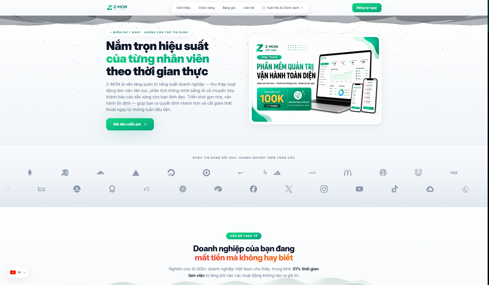
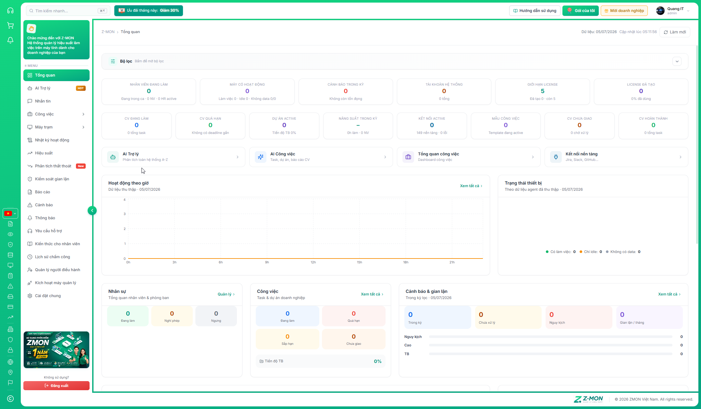
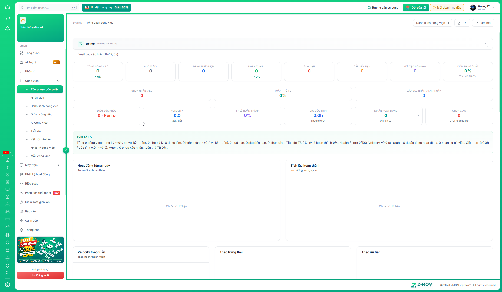
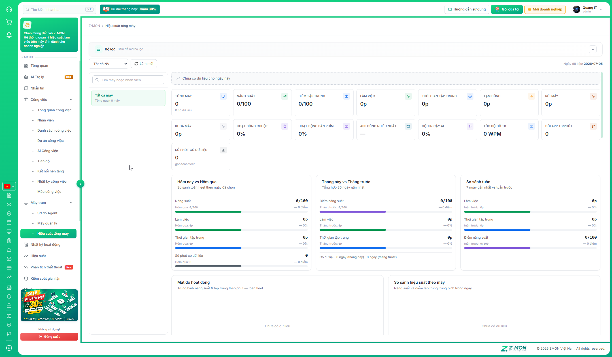

<p align="center">
  
</p>

<h1 align="center">Z-MON Việt Nam</h1>
<p align="center">
  <strong>Nền tảng quản lý hiệu suất lực lượng lao động trên máy tính — dành cho doanh nghiệp hiện đại</strong>
</p>

<p align="center">
  <a href="https://zmon.vn">Website</a> ·
  <a href="https://my.zmon.vn">Dashboard</a> ·
  <a href="https://docs.zmon.vn">Tài liệu</a> ·
  <a href="mailto:support@zmon.vn">Hỗ trợ</a>
</p>

<p align="center">
  
  
  
  
</p>

---

## Tầm nhìn & Sứ mệnh

**Z-MON** là hệ sinh thái quản trị vận hành end-to-end: thu thập dữ liệu làm việc theo phút từ máy tính nhân viên, chuyển hóa thành KPI thời gian thực, phân tích thất thoát chi phí, kiểm soát gian lận, quản lý công việc và báo cáo tập trung — trên một nền tảng thống nhất.

| Đối tượng | Z-MON giải quyết gì |
|---|---|
| **Ban lãnh đạo** | Nhìn thấy năng suất thực tế, chi phí thất thoát bằng VND, không phỏng đoán |
| **HR & Quản lý** | Đối soát chấm công, ca làm, công việc quá hạn — một nguồn dữ liệu duy nhất |
| **IT & Vận hành** | Giám sát fleet máy, cảnh báo sớm, remote control, audit đầy đủ |
| **Nhân viên** | Nhận việc, báo cáo tiến độ, chấm công, nhắn tin — ngay trên máy làm việc |

> *Triển khai gọn nhẹ · Vận hành ổn định · ROI có thể đo lường ngay từ những tuần đầu*

---

## Kiến trúc hệ thống

| Thành phần | Công nghệ | Nhiệm vụ | Tác dụng |
|---|---|---|---|
| **Landing & Marketing** | React | Thu hút khách hàng, đăng ký dùng thử, công bố chính sách pháp lý | Cổng vào thương mại — chuyển đổi visitor thành tenant |
| **Dashboard Admin** | React 18 · Tailwind CSS | Trung tâm điều hành: KPI, phân tích, cấu hình, phân quyền | Một màn hình cho toàn bộ vận hành doanh nghiệp |
| **Backend API** | Rust · Actix-web 4 | Xử lý nghiệp vụ, bảo mật JWT, WebSocket, AI streaming | Hiệu năng cao, an toàn, xử lý hàng nghìn snapshot/phút |
| **Cơ sở dữ liệu** | PostgreSQL 15 | Multi-tenant, audit trail, lưu trữ forensic dài hạn | Dữ liệu tách biệt theo doanh nghiệp, truy vết mọi thao tác |
| **ZMON Agent (Service)** | Go · Windows Service | Thu thập telemetry nền, heartbeat, đồng bộ cloud | "Mắt và tai" trên từng máy nhân viên — chạy 24/7 |
| **Agent UI (Panel)** | React · Tauri | Giao diện nhân viên: công việc, chat, chấm công, hỗ trợ | Cầu nối giữa nhân viên và ban quản lý — không cần mở browser |
| **Realtime** | WebSocket | Push tin nhắn, cảnh báo, task, trạng thái máy tức thì | Không delay — phản ứng trong giây |
| **AI** | LLM Streaming | Phân tích dữ liệu, tạo task, đề xuất hành động | Rút ngắn thời gian ra quyết định từ hàng trăm trang dữ liệu |
| **Thông báo** | Web Push · Telegram · Desktop Notify | Cảnh báo đa kênh khi admin không ở dashboard | Không bỏ lỡ sự cố nghiêm trọng |

---

## Trải nghiệm sản phẩm

### Dashboard Tổng quan — Trung tâm điều hành

**Nhiệm vụ:** Cung cấp snapshot toàn doanh nghiệp trong một lần mở trang — quản lý dùng mỗi sáng để nắm tình hình trước khi họp hoặc ra quyết định.

**Tác dụng:** Thay thế việc mở 6–8 module riêng lẻ; phát hiện bất thường qua KPI đỏ/vàng và deep link sang module chi tiết.

<p align="center">
  
</p>

| Thành phần | Nhiệm vụ | Tác dụng cụ thể |
|---|---|---|
| **Nhân viên đang làm** | Đếm NV trong ca + có hoạt động máy hôm nay | Biết ngay ai thực sự đang làm việc, không chỉ "có mặt trên HR" |
| **Máy có dữ liệu** | Phân loại: làm việc / idle / không data | Phát hiện máy cài Agent nhưng không gửi dữ liệu hoặc idle cả ngày |
| **KPI công việc** | Task đang làm, quá hạn, dự án, năng suất | Cân bằng giữa hiệu suất máy và tiến độ deliverable |
| **Biểu đồ xu hướng** | Hoạt động theo giờ, top máy theo hiệu suất | Nhận diện ngày/giờ bất thường, so sánh giữa các ca |
| **Cảnh báo & License** | Hiển thị chưa xử lý, % slot đã dùng | Ưu tiên xử lý sự cố; cảnh báo đỏ khi license ≥90% |
| **Quick access** | Nhảy nhanh AI, Công việc, Máy trạm, Báo cáo | Tiết kiệm 3–5 click mỗi lần drill-down |

---

### Module Công việc — Quản trị dự án & task doanh nghiệp

**Nhiệm vụ:** Quản lý toàn bộ vòng đời công việc — từ tạo task, gán người, theo dõi tiến độ đến đồng bộ với Jira/Slack và đối soát với dữ liệu máy.

**Tác dụng:** Một module thay thế Trello + spreadsheet + email thread; kết nối "việc được giao" với "thời gian thực tế trên máy".

<p align="center">
  
</p>

| Tính năng | Nhiệm vụ | Tác dụng |
|---|---|---|
| **Tổng quan công việc** | Health score, velocity, completion rate | Đánh giá sức khỏe dự án trong 30 giây — không cần đọc từng task |
| **Danh sách công việc** | List · Kanban · Lịch · Timeline · Gantt | Mỗi vai trò (PM, dev, HR) chọn view phù hợp workflow |
| **Dự án công việc** | Milestone, tiến độ tổng thể | Theo dõi deliverable lớn, không chỉ task lẻ |
| **AI Công việc** | Tạo task bằng ngôn ngữ tự nhiên, phân tích bottleneck | Giảm 70% thao tác nhập tay; phát hiện rủi ro deadline sớm |
| **Tiến độ** | Burndown, velocity chart | Sprint planning và retrospective có số liệu thực |
| **Kết nối nền tảng** | 149+ tích hợp OAuth/API | Đồng bộ Jira, Slack, GitHub… — không nhập tay hai lần |
| **Nhật ký công việc** | Audit user/system/AI/agent | Truy vết ai đổi deadline, khi nào sync lỗi |
| **Mẫu công việc** | Template onboarding, sprint, checklist | Chuẩn hóa quy trình — triển khai nhanh cho phòng ban mới |
| **Nhân viên** | HR profile, gán máy, ca làm, lương/giờ | Nền tảng của mọi số liệu — ca sai = analytics sai |
| **Kiến thức cho nhân viên** | Knowledge base nội bộ | NV tra cứu quy trình trên Agent — giảm ticket hỗ trợ lặp lại |
| **Lịch sử chấm công** | Đối soát Chấm công/Ra về từ Agent | Bổ sung dữ liệu máy — phát hiện muộn/sớm/tăng ca |

---

### Máy trạm & Forensic — Giám sát sâu từng thiết bị

**Nhiệm vụ:** Cho phép IT Admin và quản lý "nhìn vào" từng máy nhân viên — từ snapshot realtime đến forensic chi tiết — khi cần điều tra, hỗ trợ hoặc xác minh năng suất.

**Tác dụng:** Không cần TeamViewer để biết NV đang làm gì; có bằng chứng cụ thể khi tranh chấp hiệu suất hoặc vi phạm chính sách.

<p align="center">
  
</p>

#### Sơ đồ Agent
**Nhiệm vụ:** Trực quan hóa topology — máy nào online, ai đang gán, luồng dữ liệu Agent ↔ Cloud.  
**Tác dụng:** IT nắm fleet trong một glance; phát hiện máy orphan chưa gán nhân viên.

#### Máy quản lý — 13 tab forensic

| Tab | Nhiệm vụ | Tác dụng thực tế |
|---|---|---|
| **Tổng quan** | Snapshot realtime: CPU, RAM, disk, uptime, user | Kiểm tra máy có vấn đề phần cứng/mạng không |
| **Tiến trình** | Process tree, CPU/RAM từng app | Phát hiện app lạ, game, mining, tool gian lận |
| **Mạng** | Kết nối, bandwidth, DNS | Audit truy cập server lạ, data exfiltration |
| **Ảnh màn hình** | Screenshot theo lịch / theo sự kiện | Bằng chứng trực quan — NV đang mở gì trên màn hình |
| **Nhật ký gõ phím** | Keylog theo app, cửa sổ, URL web | Đo lường WPM, phát hiện copy-paste bất thường |
| **Phím tắt** | Shortcut history theo ứng dụng | Xác minh thao tác thực vs autoclicker/macro |
| **Clipboard** | Sao chép/dán — audit nội dung | Kiểm soát leak dữ liệu nhạy cảm |
| **Trình duyệt** | Lịch sử web, tab đang mở | Phân loại thời gian làm việc vs giải trí |
| **USB** | Thiết bị cắm/rút | Cảnh báo copy file ra ngoài qua USB |
| **Tải xuống** | File download tracking | Audit file tải về — malware, dữ liệu lạ |
| **Tệp tin** | Thay đổi file hệ thống | Phát hiện chỉnh sửa/xóa file quan trọng |
| **Ứng dụng** | App usage, icon, thời gian focus | Biết NV dành bao nhiêu % thời gian cho Excel vs Facebook |
| **Hiệu suất** | Productivity score, focus time, AFK | Chấm điểm năng suất có trọng số — so sánh NV/phòng ban |

**Điều khiển từ xa**

| Lệnh | Nhiệm vụ | Tác dụng |
|---|---|---|
| Khóa màn hình | Bảo vệ máy khi NV rời chỗ | Ngăn truy cập trái phép |
| Restart / Shutdown | Bảo trì từ xa | IT xử lý sự cố không cần đến tận nơi |
| Bật/tắt thu thập | Tạm dừng ingest khi bảo trì hoặc theo chính sách | Tuân thủ quyền riêng tư / nghỉ phép |

**Bảo mật dữ liệu forensic**
- OTP mở khóa xem dữ liệu nhạy cảm (30 phút/máy) — chỉ admin được cấp quyền
- Audit log mọi lần mở khóa và xem tab forensic
- Operator chỉ thấy tab được phân quyền View/Edit

#### Hiệu suất tổng máy
**Nhiệm vụ:** So sánh fleet theo kỳ — hôm nay vs hôm qua, tuần vs tuần trước, tháng vs tháng trước.  
**Tác dụng:** Phát hiện xu hướng giảm năng suất theo phòng ban; benchmark top performer.

---

## ZMON Agent — Trái tim của hệ thống

Agent là **hai lớp** hoạt động song song trên máy nhân viên Windows:

```
┌─────────────────────────────────────────────────────────────┐
│  ZMON Agent UI (Tauri + React)                              │
│  Panel nổi · System tray · 9 tab nhân viên                  │
│  → Giao tiếp với ban quản lý, nhận việc, chấm công          │
├─────────────────────────────────────────────────────────────┤
│  ZMON Agent Service (Go · Windows Service)                  │
│  Chạy nền 24/7 · Heartbeat 2s · Thu thập theo phút           │
│  → Gửi telemetry lên cloud.zmon.vn                          │
└─────────────────────────────────────────────────────────────┘
```

### Sứ mệnh tổng thể của Agent

| Vai trò | Nhiệm vụ | Ai được hưởng lợi |
|---|---|---|
| **Thu thập dữ liệu** | Ghi nhận hoạt động máy theo phút, đồng bộ realtime | Admin, HR, quản lý — có số liệu đối soát |
| **Cầu nối nhân viên** | NV nhận task, chat, hỗ trợ, chấm công ngay trên máy | Nhân viên — không cần app/email riêng |
| **Tuân thủ chính sách** | Chạy theo config server — bật/tắt từng loại thu thập | Doanh nghiệp — kiểm soát phạm vi giám sát |
| **Bảo mật license** | Heartbeat, ping, revoke khi hết hạn/vi phạm | SaaS — chống dùng trái phép |

---

### Agent Service (lớp nền — Go)

**Nhiệm vụ:** Chạy như Windows Service, không phụ thuộc user đăng nhập/đăng xuất — thu thập liên tục khi máy bật.

| Luồng | Chu kỳ | Thu thập gì | Tác dụng |
|---|---|---|---|
| **Heartbeat** | ~2 giây | Cửa sổ đang focus, AFK status, input counts | Biết NV đang làm gì *ngay bây giờ* |
| **Stats** | Theo cấu hình | CPU, RAM, disk, network, active user | Cảnh báo máy quá tải, phát hiện máy không ai dùng |
| **Processes** | Theo cấu hình | Toàn bộ process đang chạy + icon | Forensic tab Tiến trình |
| **Screenshot** | Theo lịch/sự kiện | Ảnh màn hình nén | Bằng chứng trực quan khi cần |
| **Keylog** | Realtime (có toggle) | Phím gõ theo app/URL | WPM, phát hiện gian lận input |
| **Clipboard** | Realtime (có toggle) | Nội dung copy/paste | Kiểm soát leak dữ liệu |
| **Browser** | Incremental | Lịch sử web, tab mở | Phân loại thời gian làm việc |
| **USB** | Event-driven | Thiết bị cắm/rút | Audit dữ liệu ra ngoài |
| **Downloads** | Incremental | File tải về | Phát hiện file lạ/malware |
| **File watch** | Event-driven | Thay đổi file theo rule | Phát hiện chỉnh sửa tài liệu quan trọng |
| **Activity agg** | Theo phút | Productivity score, focus time, app switching | Tab Hiệu suất & Báo cáo |
| **Config sync** | Định kỳ | Nhận toggle từ server | Admin bật/tắt thu thập từ xa không cần cài lại |
| **License ping** | Định kỳ | Xác thực token, revoke nếu 401 | Bảo vệ slot license |

**Đặc điểm kỹ thuật:**
- Event queue 2000 events — không mất dữ liệu khi mạng chập chờn
- `flIngest` toggle — admin tạm dừng upload mà service vẫn chạy
- Auto-update qua `download.zmon.vn` — không cần IT deploy thủ công từng máy
- AFK detection — phân biệt "máy bật" vs "người đang làm"

---

### Agent UI (lớp giao diện — Tauri + React)

**Nhiệm vụ:** Cung cấp workspace cá nhân cho nhân viên — mọi tương tác với công ty qua một panel nổi hoặc system tray, không cần mở dashboard web.

**Tác dụng:** Tăng tỷ lệ phản hồi task/chat; giảm email và họp không cần thiết.

#### 9 tab Agent UI — Chi tiết chức năng

| Tab | Nhiệm vụ | Tác dụng cho nhân viên | Tác dụng cho quản lý |
|---|---|---|---|
| **Tổng quan** | Dashboard cá nhân: trạng thái kết nối, task hôm nay, chấm công, KPI nhanh | Mở Agent là biết việc gì cần làm ngay | Giảm NV "quên" task mới giao |
| **Công việc** | Nhận task, xác nhận (ack), bắt đầu làm, phiên làm, báo cáo tiến độ, hoàn thành | Workflow rõ 4 bước — không nhầm trạng thái | Biết chính xác ai đã nhận việc, ai đang làm, % tiến độ |
| **Lịch** | Xem ca làm (ngày/đêm/fulltime), deadline, nhắc việc | NV biết hôm nay ca gì, deadline nào sắp tới | Đồng bộ kỳ vọng ca làm — tránh tranh chấp |
| **Thông báo** | Tin nhắn với ban lãnh đạo + hộp thư hệ thống | Nhận thông báo nội bộ ngay trên máy — có chuông | Broadcast chính sách, nhắc nhở — không qua email |
| **Báo cáo** | KPI cá nhân: hoàn thành, đúng hạn, giờ làm, biểu đồ tuần | NV tự theo dõi hiệu suất — tăng ownership | Giảm hỏi "tháng này em làm được bao nhiêu?" |
| **Chấm công** | Chấm công vào / Ra về (một lần/ngày) | Thao tác 1 click khi bắt đầu/kết thúc ca | Dữ liệu đối soát HR — bổ sung snapshot máy |
| **Hỗ trợ** | Gửi ticket kỹ thuật, chat hai chiều với admin | Báo lỗi Agent, máy, tài khoản — có thread | IT xử lý tập trung tại dashboard Yêu cầu hỗ trợ |
| **Kiến thức** | Tra cứu quy trình, FAQ, tài liệu nội bộ | Tự phục vụ — không hỏi lại quy trình đã có | Giảm ticket lặp; onboarding NV mới nhanh hơn |
| **Thiết bị** | Thông tin máy, phiên bản Agent, trạng thái kết nối | NV biết Agent có đang hoạt động không | IT debug từ xa — version, last seen |

#### Tính năng bổ sung Agent UI

| Tính năng | Nhiệm vụ | Tác dụng |
|---|---|---|
| **Floating Action Button** | Nút nổi góc màn hình — badge theo ưu tiên chat/task/support | Luôn hiện diện — NV không "tắt quên" Agent |
| **System tray** | Chạy nền, mở panel từ tray icon | Không chiếm taskbar; chạy suốt ca làm |
| **Thông báo desktop + chuông** | Alert khi có tin nhắn, task mới, phản hồi hỗ trợ | Phản hồi nhanh — không cần mở panel liên tục |
| **Đa ngôn ngữ VI/EN** | Chuyển giao diện Agent | Phù hợp doanh nghiệp đa quốc gia |
| **Offline outbox** | Queue thao tác task khi mất mạng, sync khi online | Không mất báo cáo tiến độ khi wifi chập |
| **Lock overlay** | Khóa màn hình từ xa theo lệnh admin | Bảo mật khi NV rời máy không khóa |

---

## AI — Trí tuệ nhân tạo tích hợp

### AI Trợ lý (toàn hệ thống)

**Nhiệm vụ:** Trả lời câu hỏi bằng ngôn ngữ tự nhiên — truy vấn dữ liệu doanh nghiệp thật, không bịa số.

**Tác dụng:** Thay 15–30 phút lọc thủ công bằng 1 câu hỏi: *"Ai idle nhiều nhất tuần này?"*, *"Báo cáo hiệu suất phòng Kế toán 7 ngày qua"*.

| Khả năng | Chi tiết |
|---|---|
| Chat streaming | Phản hồi dần realtime — có nút dừng generation |
| 30 phiên hội thoại | Lưu server, tiêu đề tự động, chuyển phiên dễ dàng |
| 8+ chip gợi ý | Tổng quan NV, máy offline, cảnh báo critical, thất thoát… |
| Structured output | Bảng/biểu đồ kèm câu trả lời khi tool trả về data |
| Phân quyền | Chỉ đọc dữ liệu tenant hiện tại — Operator cần quyền View/Edit |

### AI Công việc (chuyên module Work)

**Nhiệm vụ:** Tạo và phân tích task — preview trước khi lưu, không tự động gán mà không xác nhận.

**Tác dụng:** PM tạo 10 task từ mô tả sprint trong 1 phút; phát hiện bottleneck trước deadline 3 ngày.

---

## Phân tích & Báo cáo

### Hiệu suất

| Tab | Nhiệm vụ | Tác dụng |
|---|---|---|
| **Máy tính** | Productivity theo NV, máy, phòng ban | Trả lời "phòng nào hiệu quả nhất?" |
| **Công việc** | Task completion, velocity, overdue trend | Trả lời "team có kịp deadline không?" |

### Phân tích thất thoát

**Nhiệm vụ:** Quy đổi phút idle/low-productivity thành **chi phí VND** theo lương/giờ.

**Tác dụng:** Ban lãnh đạo thấy ROI rõ ràng — *"Tháng này thất thoát 47 triệu VND do idle trong ca"*.

- Chỉ tính phút trong ca làm đã cấu hình (múi giờ VN UTC+7)
- Lương/giờ theo từng NV hoặc mặc định công ty

### Kiểm soát gian lận

**Nhiệm vụ:** Quét tự động nền mỗi khi Agent gửi dữ liệu — phát hiện pattern bất thường.

**Tác dụng:** Phát hiện autoclicker, macro, tool fake activity — có evidence để xử lý kỷ luật.

| Loại | Phát hiện |
|---|---|
| Autoclicker | Click đều đặn không tự nhiên |
| Macro | Chuỗi phím lặp theo pattern |
| App/site blacklist | Truy cập tool gian lận đã cấu hình |
| Rule tùy chỉnh | Preset theo chính sách từng công ty |

### Báo cáo

**Nhiệm vụ:** Xuất dữ liệu định kỳ cho họp điều hành, audit, lưu trữ.

| Tab | Nội dung |
|---|---|
| Tổng quan | Snapshot KPI kỳ lọc |
| Máy tính | Productivity, focus, top app |
| Công việc | Completion, overdue, velocity |
| Thất thoát | Thời gian + chi phí VND |

**Xuất:** CSV / Excel 5 sheet · Lọc thời gian, phòng ban, nhân viên

---

## Cảnh báo & Thông báo

### Cảnh báo (Alerts)

**Nhiệm vụ:** Chuyển ngưỡng kỹ thuật thành ticket có workflow — không chỉ log im lặng.

| Loại cảnh báo | Ngưỡng mẫu | Tác dụng |
|---|---|---|
| Tài nguyên | CPU >90%, RAM cao, disk đầy | IT xử lý trước khi máy treo |
| Hành vi | Idle >30 phút, hiệu suất thấp | Quản lý nhắc NV hoặc điều tra |
| Gian lận | Pattern autoclicker/macro | HR có bằng chứng xử lý |
| Hạ tầng | Máy mất kết nối >X phút | IT biết máy offline — không đợi NV báo |
| License | Slot sắp hết, revoke | Mua thêm trước khi chặn NV mới |

**Workflow:** Mở → Đang xử lý → Resolved · Phân loại Critical / High / Medium / Low

### Thông báo đa kênh

| Kênh | Nhiệm vụ | Khi nào hữu ích |
|---|---|---|
| **Dashboard hub** | Chuông + toast + desktop notify trong tab | Admin đang mở dashboard |
| **Web Push** | Service Worker — nhận khi đóng tab | Admin rời dashboard nhưng vẫn cần alert |
| **Telegram Bot** | 30+ sự kiện cấu hình được | Cảnh báo ngoài giờ, on-call IT |
| **Agent EXE** | Thông báo task, chat, hỗ trợ, hộp thư | Nhân viên trên máy — phản hồi nhanh |

---

## Giao tiếp & Hỗ trợ

| Kênh | Đối tượng | Nhiệm vụ | Tác dụng |
|---|---|---|---|
| **Nhắn tin** | Admin ↔ Nhân viên | Chat realtime WebSocket, đính kèm file 5MB | Nhắc việc, thông báo nội bộ — thay email/chat app riêng |
| **Yêu cầu hỗ trợ** | Nhân viên → Admin | Ticket từ Agent tab Hỗ trợ, workflow open/inprogress/resolved | IT xử lý tập trung — có lịch sử thread |
| **Hỗ trợ Z-MON online** | Khách hàng → Z-MON | Chat với đội ngũ Z-MON | Hỗ trợ sản phẩm, billing, kỹ thuật triển khai |
| **Thông báo hệ thống** | Platform → Tenant | Announcement, cập nhật, khuyến mãi | Thông tin chính thức từ Z-MON — không qua email spam |

---

## Quản trị & Bảo mật

### Phân quyền Operator

**Nhiệm vụ:** Cho phép nhiều người vận hành mà không ai thấy/quyền hơn mức cần thiết.

| Cơ chế | Chi tiết |
|---|---|
| Ma trận **Edit / View / Deny** | Theo từng menu feature — không all-or-nothing |
| Role template | Admin · Quản lý · IT · Giám sát — triển khai nhanh |
| Audit log | Mọi đăng nhập, cấu hình, CRUD — truy vết sự cố |

### Đa tenant SaaS

**Nhiệm vụ:** Mỗi doanh nghiệp là một tenant độc lập — dữ liệu, license, billing tách biệt.

- Trial 7 ngày · Gói theo license slot
- Gia hạn · thanh toán · hóa đơn · hợp đồng dịch vụ số

### Bảo mật phiên đăng nhập

| Cơ chế | Chi tiết | Tác dụng |
|---|---|---|
| JWT access + refresh | HttpOnly cookie | Chống XSS đánh cắp token |
| Phiên 24 giờ | Auto refresh | Cân bằng UX và bảo mật |
| Tối đa 2 thiết bị | Per admin account | Chống chia sẻ tài khoản admin |
| 2FA TOTP | Tuỳ chọn bật | Bảo vệ tài khoản cấp cao |
| OTP forensic | 30 phút/máy | Dữ liệu nhạy cảm cần xác thực thêm |
| Rate limiting | API gateway | Chống brute force |

### Tuân thủ pháp lý

**Nhiệm vụ:** Cung cấp khung pháp lý rõ ràng cho giám sát nhân viên tại VN và quốc tế.

17+ chính sách: Điều khoản · Bảo mật · GDPR · CCPA · Luật ANM VN · Chính sách giám sát nhân viên · DPA…

---

## Tích hợp nền tảng (149+)

**Nhiệm vụ:** Đồng bộ dữ liệu công việc hai chiều — Z-MON không thay thế Jira/Slack mà **kết nối** với chúng.

**Tác dụng:** Một nguồn sự thật — task tạo ở Jira hiện trên Agent; tiến độ báo từ Agent sync ngược.

| Nền tảng | OAuth / API |
|---|---|
| Jira · Slack · Google Workspace · GitHub · Microsoft | Đăng nhập liên kết |
| Trello · Confluence · Asana · Notion · HubSpot · Salesforce | API key / webhook |
| + hàng trăm nền tảng khác | Automation rules |

- Đồng bộ tăng dần / toàn bộ
- Webhook receiver · Sync log · Error reconnect · Field mapping

---

## Công cụ tiện ích Dashboard

| Công cụ | Nhiệm vụ | Tác dụng |
|---|---|---|
| **Ctrl+K** | Tìm kiếm nhanh mọi trang, chức năng | Điều hướng 2 giây thay vì click sidebar |
| **Hướng dẫn sử dụng** | Tài liệu A-Z tích hợp trong dashboard | Onboarding admin mới — không cần đọc PDF |
| **Gói của tôi** | Thông tin subscription, license đã dùng | Biết còn bao nhiêu slot trước khi hết |
| **Mời doanh nghiệp** | Chương trình giới thiệu affiliate | Mở rộng qua referral |
| **Giỏ hàng & Gia hạn** | Mua gói, thanh toán, nâng cấp | Self-service billing |
| **Nhật ký hoạt động** | Audit trail toàn hệ thống | Điều tra "ai đổi cấu hình lúc 2h sáng?" |
| **Kích hoạt** | Tạo license, tải Agent, theo dõi slot | Bước đầu tiên mọi triển khai |
| **Cài đặt chung** | Hạ tầng · Telegram · API/Webhook · Giới thiệu | Cấu hình một lần — dùng lâu dài |
| **Hồ sơ** | Đổi mật khẩu, 2FA, avatar | Bảo mật tài khoản cá nhân |

---

## Bản đồ tính năng đầy đủ

```
Z-MON
├── 🏠 Tổng quan
│   ├── Nhiệm vụ: Snapshot điều hành toàn DN
│   └── Tác dụng: KPI realtime · Biểu đồ · Quick access · Deep link
│
├── 🤖 AI Trợ lý
│   ├── Nhiệm vụ: Hỏi đáp dữ liệu bằng ngôn ngữ tự nhiên
│   └── Tác dụng: Streaming · 30 phiên · Phân tích A-Z · Gợi ý thông minh
│
├── 💬 Nhắn tin
│   ├── Nhiệm vụ: Giao tiếp Admin ↔ NV realtime
│   └── Tác dụng: Chat · Đính kèm · Badge unread · Online status
│
├── 📋 Công việc
│   ├── Tổng quan công việc — Health · Velocity · AI Summary
│   ├── Nhân viên — HR · Ca làm · Gán máy · Lương/giờ
│   ├── Danh sách công việc — List · Kanban · Lịch · Gantt
│   ├── Dự án công việc — Milestone · Progress
│   ├── AI Công việc — NL task · Risk · Bottleneck
│   ├── Tiến độ — Burndown · Velocity
│   ├── Kết nối nền tảng — 149+ integrations
│   ├── Nhật ký công việc — Sync · Automation audit
│   └── Mẫu công việc — Templates tái sử dụng
│
├── 🖥️ Máy trạm
│   ├── Sơ đồ Agent — Topology · Status map
│   ├── Máy quản lý — 13 forensic tabs · Remote · OTP unlock
│   └── Hiệu suất tổng máy — Fleet analytics · So sánh kỳ
│
├── 📊 Hiệu suất — Machine + Work tabs
├── 📉 Phân tích thất thoát — Time + Cost (VND)
├── 🛡️ Kiểm soát gian lận — Autoclicker · Macro · Rules
├── 📑 Báo cáo — CSV/Excel 5 sheets
├── 🔔 Cảnh báo — Threshold · Severity · Workflow
├── 📣 Thông báo — Hub · Web Push · Telegram · Agent
├── 🎫 Yêu cầu hỗ trợ — Ticket từ Agent
├── 📚 Kiến thức NV — Knowledge base
├── ⏱️ Lịch sử chấm công — Attendance audit
├── 👤 Quản lý Operator — Roles · Permissions matrix
├── 🔑 Kích hoạt — License · Agent download
├── ⚙️ Cài đặt chung — Infra · Notify · API
│
└── 🖥️ ZMON Agent (Desktop)
    ├── Service (Go) — Thu thập nền 24/7 · Heartbeat · Telemetry
    └── UI (Tauri) — 9 tab NV · Panel · Tray · Notify · VI/EN
```

---

## Quy trình triển khai chuẩn

| Bước | Hành động | Kết quả mong đợi |
|---|---|---|
| 1 | Đăng nhập Admin → Cài đặt → xác nhận hạ tầng xanh | Server sẵn sàng |
| 2 | Kích hoạt → Tạo license → Tải Agent | Có key và file cài |
| 3 | Cài Agent trên máy NV → Nhập license | Máy xuất hiện tại Máy quản lý |
| 4 | Nhân viên → Thêm hồ sơ → Gán máy → Cấu hình ca làm | Analytics có nền tảng đúng |
| 5 | Cảnh báo → Cấu hình ngưỡng | Nhận alert khi bất thường |
| 6 | (Tuỳ chọn) Telegram + Tích hợp Jira/Slack | Thông báo ngoài giờ + sync công việc |
| 7 | Sau 1 ca làm đầy đủ → Mở Tổng quan | 14 KPI có dữ liệu thật |
| 8 | Phân tích thất thoát + Xuất Báo cáo Excel | Số liệu cho ban lãnh đạo |

---

## Liên kết chính thức

| | |
|---|---|
| 🌐 **Website** | [zmon.vn](https://zmon.vn) |
| 📊 **Dashboard** | [my.zmon.vn](https://my.zmon.vn) |
| 📖 **Tài liệu** | [docs.zmon.vn](https://docs.zmon.vn) |
| ☁️ **API** | [cloud.zmon.vn](https://cloud.zmon.vn) |
| 📥 **Agent Update** | [download.zmon.vn](https://download.zmon.vn) |
| ✉️ **Hỗ trợ** | [support@zmon.vn](mailto:support@zmon.vn) |

---

## Tác giả

<p align="center">
  
</p>

<p align="center">
  <strong>QUANG IT</strong><br/>
  <em>Kiến trúc sư & Nhà phát triển chính — Z-MON Việt Nam</em>
</p>

<p align="center">
  Z-MON được thiết kế, phát triển và vận hành bởi <strong>QUANG IT</strong> — kết hợp tư duy sản phẩm SaaS hiện đại,<br/>
  kỹ nghệ backend hiệu năng cao (Rust) và trải nghiệm dashboard doanh nghiệp chuẩn quốc tế.<br/>
  Sứ mệnh: mang lại minh bạch năng suất và giảm thất thoát chi phí lao động cho doanh nghiệp Việt Nam và khu vực.
</p>

<p align="center">
  <a href="https://github.com/zmonvietnam">GitHub</a> ·
  <a href="mailto:support@zmon.vn">Liên hệ hợp tác</a>
</p>

---

<p align="center">
  <sub>© 2026 Z-MON Việt Nam · Bản quyền thuộc về Z-MON · Phát triển bởi QUANG IT</sub><br/>
  <sub>Phần mềm thương mại · Dùng thử miễn phí 7 ngày</sub>
</p>
